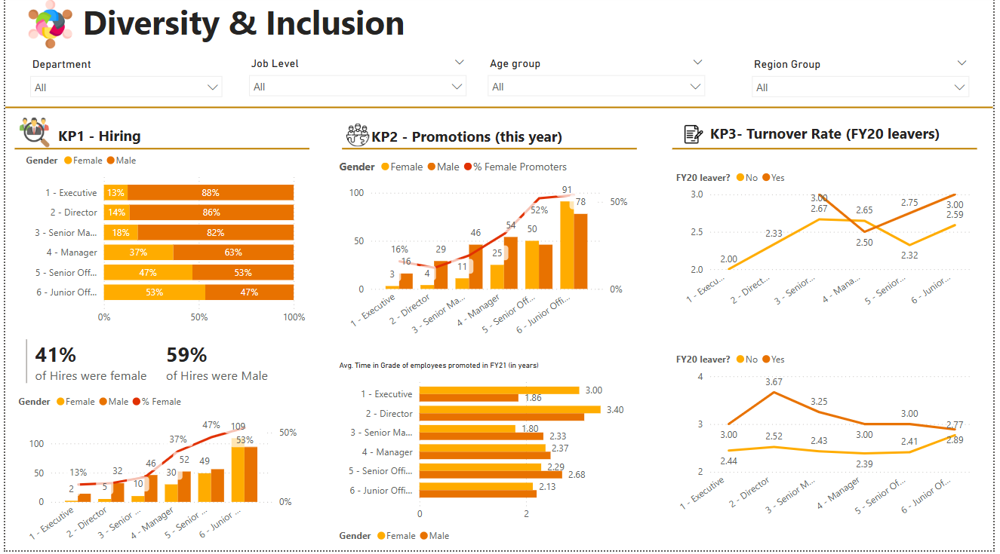
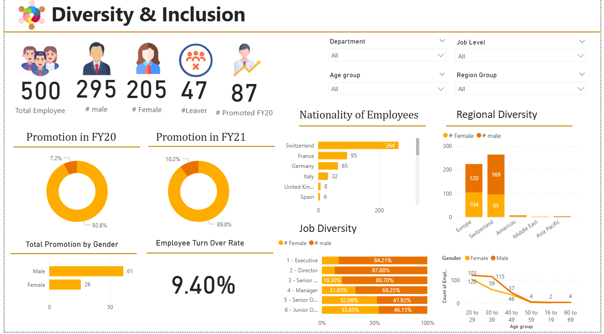
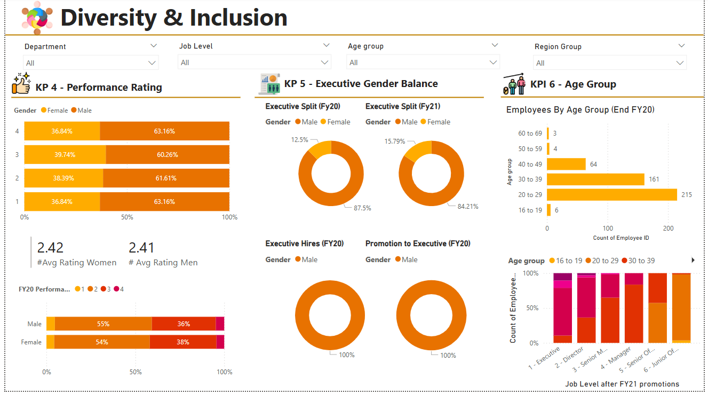

# 🌍 Diversity & Inclusion Dashboard (Power BI)

This project presents a **Diversity and Inclusion Dashboard** designed using Microsoft Power BI. It helps visualize and analyze key metrics related to workforce diversity across gender, ethnicity, and roles — aiming to support organizations in promoting a more inclusive work culture.

## 📊 Features

- **Gender Representation** across departments and seniority levels  
- **Ethnic Diversity Breakdown** with visual comparisons  
- **Inclusion Score Trends** over time (if available)  
- **Hiring vs. Retention Rates** by demographic groups  
- Interactive filters to drill down by region, team, or department  

## 💡 Objective

To provide HR and leadership teams with actionable insights that promote equitable hiring practices and highlight diversity strengths and gaps within an organization.

## 🛠 Built With

- **Microsoft Power BI**
- Custom visuals and slicers
- Clean, accessible design for non-technical stakeholders

## 📁 File

- `DiversityDashboard.pbix` — Power BI report file (open in Power BI Desktop)

## 🧑‍💼 Use Cases

- HR strategy and reporting  
- Quarterly diversity reviews  
- Boardroom presentations on DEI metrics  
- Internal audits and transparency initiatives  

## 🚀 Getting Started

To open and explore the dashboard:
1. Download [Power BI Desktop](https://powerbi.microsoft.com/desktop)
2. Clone or download this repository
3. Open the `.pbix` file and interact with the visuals

## 🖼️ Dashboard Preview

 

## 📝 License

This project is open for learning, presentation, and non-commercial use.

---

Feel free to add real data or simulated samples for visual impact.
